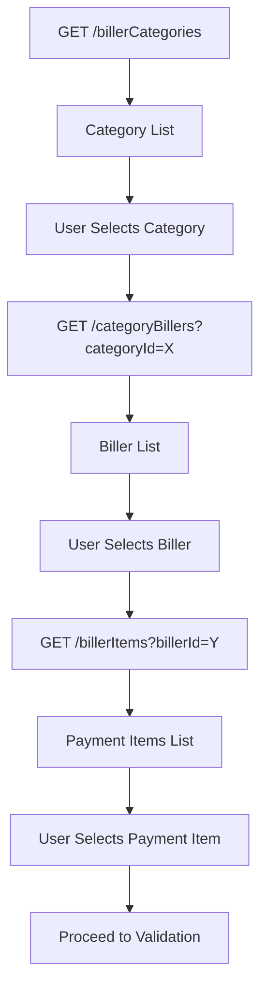

Payment items represent the specific products or services that a biller offers. Once users select a biller, you can fetch all available payment items to display the options they can pay for.

## Endpoint details

**GET** `/isw/payments/billerItems?billerId={billerId}`

### Query parameters

<ParamField query="billerId" type="string" required>
  The unique identifier of the biller
</ParamField>

## Controller implementation

The endpoint is defined in `PaymentsController`:

```java PaymentsController.java:55-59
@GetMapping("/billerItems")
public String getPaymentItemsByBiller(@PathParam("billerId") String billerId) throws Exception {

    return paymentsService.getBillerItems(billerId);
}
```

## Service implementation

The `getBillerItems()` method in `PaymentsService` retrieves the payment items:

```java PaymentsService.java:136-149
public String getBillerItems(String billerId) throws Exception {

	String endpointUrl =  Constants.BILLERS_ROOT +  "items/biller-id/"+billerId;

	SystemResponse<KeyExchangeResponse> exchangeKeys = keyExchangeService.doKeyExchange();

	if(exchangeKeys.getResponseCode().equals(PhoenixResponseCodes.APPROVED.CODE)) {
		Map<String,String> headers = AuthUtils.generateInterswitchAuth(Constants.GET_REQUEST, endpointUrl, "",exchangeKeys.getResponse().getAuthToken(),exchangeKeys.getResponse().getTerminalKey());
		return HttpUtil.getHTTPRequest(endpointUrl, headers);
	}
	else {
		return "Cannot Fetch Biller Items,Key Exchange failed";
	}
}
```

## How it works

<Steps>
  <Step title="Receive biller ID">
    The endpoint accepts a biller ID as a query parameter from the previous step.
  </Step>
  
  <Step title="Execute key exchange">
    Performs key exchange to obtain fresh authentication credentials for the API call.
  </Step>
  
  <Step title="Construct endpoint URL">
    Builds the Phoenix API URL: `{BILLERS_ROOT}/items/biller-id/{billerId}`
  </Step>
  
  <Step title="Generate auth headers">
    Creates the required Interswitch authentication headers with the auth token and terminal key.
  </Step>
  
  <Step title="Retrieve payment items">
    Makes the GET request and returns all available payment items for the biller.
  </Step>
</Steps>

## Making a request

Example request from the Postman collection:

```bash
curl "http://localhost:8081/isw/payments/billerItems?billerId=23"
```

<Note>
The example uses biller ID `23`. Replace this with an actual biller ID obtained from the `/categoryBillers` endpoint.
</Note>

## Error handling

<Warning>
If the key exchange fails, the service returns: "Cannot Fetch Biller Items,Key Exchange failed"
</Warning>

Troubleshooting checklist:
- **Invalid biller ID**: Verify the biller exists by checking the category billers list
- **Authentication issues**: Ensure your client credentials are current and valid
- **Key exchange failure**: Check that a new client secret was updated after registration
- **Network connectivity**: Verify connection to the Phoenix API endpoints

## Response format

The endpoint returns a JSON response containing all payment items for the biller. Each payment item typically includes:
- Payment code (used for validation and payment)
- Item name
- Description
- Amount (if fixed) or amount type (if variable)
- Currency code
- Validation requirements
- Other item-specific metadata

## Complete biller query flow

Here's how the three biller endpoints work together:



<Info>
After retrieving payment items, you'll typically use the payment code from the selected item when calling the customer validation and payment endpoints.
</Info>

## Using payment items

Once you have the payment items, the next steps are:

1. Present the items to the user
2. Collect the payment code from the selected item
3. Use the payment code in the validation request
4. Process the payment after successful validation

## Next steps

<CardGroup cols={2}>
  <Card title="Customer validation" icon="shield-check" href="/payments/validation">
    Validate customer details before payment
  </Card>
  <Card title="Make payment" icon="credit-card" href="/payments/payment">
    Process the actual payment transaction
  </Card>
</CardGroup>