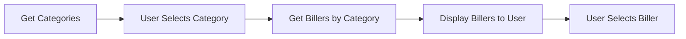

Once you have a category ID, you can fetch all billers that belong to that category. This allows you to present users with a filtered list of payment providers based on their selected category.

## Endpoint details

**GET** `/isw/payments/categoryBillers?categoryId={categoryId}`

### Query parameters

<ParamField query="categoryId" type="string" required>
  The unique identifier of the biller category
</ParamField>

## Controller implementation

The endpoint is defined in `PaymentsController`:

```java PaymentsController.java:49-53
@GetMapping("/categoryBillers")
public String getBillersByCategory(@PathParam("categoryId") String categoryId) throws Exception {

    return paymentsService.getCategoryBillers(categoryId);
}
```

## Service implementation

The `getCategoryBillers()` method in `PaymentsService` handles the biller retrieval:

```java PaymentsService.java:121-134
public String getCategoryBillers(String categoryId) throws Exception {

	String endpointUrl =  Constants.BILLERS_ROOT +  "biller-by-category/"+categoryId;

	SystemResponse<KeyExchangeResponse> exchangeKeys = keyExchangeService.doKeyExchange();

	if(exchangeKeys.getResponseCode().equals(PhoenixResponseCodes.APPROVED.CODE)) {
		Map<String,String> headers = AuthUtils.generateInterswitchAuth(Constants.GET_REQUEST, endpointUrl, "",exchangeKeys.getResponse().getAuthToken(),exchangeKeys.getResponse().getTerminalKey());
		return HttpUtil.getHTTPRequest(endpointUrl, headers);
	}
	else {
		return "Cannot Fetch Billers,Key Exchange failed";
	}
}
```

## How it works

<Steps>
  <Step title="Receive category ID">
    The endpoint accepts a category ID as a query parameter.
  </Step>
  
  <Step title="Perform key exchange">
    Obtains fresh authentication credentials from the key exchange service.
  </Step>
  
  <Step title="Build endpoint URL">
    Constructs the Phoenix API endpoint: `{BILLERS_ROOT}/biller-by-category/{categoryId}`
  </Step>
  
  <Step title="Generate authentication">
    Creates Interswitch auth headers using the obtained auth token and terminal key.
  </Step>
  
  <Step title="Execute request">
    Sends the GET request and returns all billers in the specified category.
  </Step>
</Steps>

## Making a request

Example request using the Postman collection:

```bash
curl "http://localhost:8081/isw/payments/categoryBillers?categoryId=10"
```

<Note>
The example uses category ID `10`. Replace this with an actual category ID obtained from the `/billerCategories` endpoint.
</Note>

## Error handling

<Warning>
If key exchange fails, the service returns: "Cannot Fetch Billers,Key Exchange failed"
</Warning>

Common issues:
- Invalid category ID: Verify the category exists using the `/billerCategories` endpoint
- Authentication failure: Check your client credentials in `application.properties`
- Network issues: Ensure connectivity to the Phoenix API

## Response format

The endpoint returns a JSON response containing all billers in the category. Each biller includes:
- Biller ID (needed to fetch payment items)
- Biller name
- Description
- Available payment methods
- Other biller-specific metadata

## Typical workflow



## Next steps

<CardGroup cols={2}>
  <Card title="Get biller categories" icon="arrow-left" href="/billers/categories">
    Learn how to retrieve category IDs
  </Card>
  <Card title="Get payment items" icon="arrow-right" href="/billers/biller-items">
    Fetch payment items for a selected biller
  </Card>
</CardGroup>